# Contract Call-Graph

_Generated by `scripts/contract_callgraph.py`._

- Functions analyzed: **95**
- Public entry points (`#[contractimpl]`): **48**
- Functions with auth checkpoints: **29**
- Cross-contract call sites: **11**

Legend: `([rounded])` = public entry point, `🔒` = has an authorization checkpoint, `🌐` = external contract reached via a generated client, dashed edge = cross-contract call.

## Diagram

```mermaid
flowchart LR
  subgraph committee_registry["📜 committee-registry"]
    committee_registry_lib_create_epoch(["🔒 lib::create_epoch"])
    committee_registry_lib_deregister_member(["🔒 lib::deregister_member"])
    committee_registry_lib_get_current_epoch(["lib::get_current_epoch"])
    committee_registry_lib_get_game_liveness(["lib::get_game_liveness"])
    committee_registry_lib_get_member(["lib::get_member"])
    committee_registry_lib_get_timeout_config(["lib::get_timeout_config"])
    committee_registry_lib_initialize(["🔒 lib::initialize"])
    committee_registry_lib_is_paused(["lib::is_paused"])
    committee_registry_lib_pause(["🔒 lib::pause"])
    committee_registry_lib_redistribute_slashed_stake["lib::redistribute_slashed_stake"]
    committee_registry_lib_register_member(["🔒 lib::register_member"])
    committee_registry_lib_report_slash(["🔒 lib::report_slash"])
    committee_registry_lib_report_timeout(["lib::report_timeout"])
    committee_registry_lib_require_admin["lib::require_admin"]
    committee_registry_lib_set_timeout_config(["🔒 lib::set_timeout_config"])
    committee_registry_lib_slash_member_record["lib::slash_member_record"]
    committee_registry_lib_slash_member_stake["lib::slash_member_stake"]
    committee_registry_lib_timeout_for_phase["lib::timeout_for_phase"]
    committee_registry_lib_track_game_phase(["🔒 lib::track_game_phase"])
    committee_registry_lib_unpause(["🔒 lib::unpause"])
  end
  subgraph game_hub["📜 game-hub"]
    game_hub_lib_end_game(["lib::end_game"])
    game_hub_lib_start_game(["lib::start_game"])
  end
  subgraph poker_table["📜 poker-table"]
    poker_table_betting_advance_to_next_phase["betting::advance_to_next_phase"]
    poker_table_betting_advance_turn["betting::advance_turn"]
    poker_table_betting_emit_action["betting::emit_action"]
    poker_table_betting_find_player_seat["betting::find_player_seat"]
    poker_table_betting_is_round_complete["betting::is_round_complete"]
    poker_table_betting_max_bet_this_round["betting::max_bet_this_round"]
    poker_table_betting_process_action["betting::process_action"]
    poker_table_betting_reset_round["betting::reset_round"]
    poker_table_game_active_player_count["game::active_player_count"]
    poker_table_game_build_tied_winners["game::build_tied_winners"]
    poker_table_game_build_winner_ranking["game::build_winner_ranking"]
    poker_table_game_last_player_standing["game::last_player_standing"]
    poker_table_game_post_blind["game::post_blind"]
    poker_table_game_settle_fold_win["game::settle_fold_win"]
    poker_table_game_settle_showdown["game::settle_showdown"]
    poker_table_game_start_new_hand["game::start_new_hand"]
    poker_table_game_hub_notify_end["game_hub::notify_end"]
    poker_table_game_hub_notify_start["game_hub::notify_start"]
    poker_table_lib_claim_timeout(["🔒 lib::claim_timeout"])
    poker_table_lib_commit_deal(["🔒 lib::commit_deal"])
    poker_table_lib_create_table(["🔒 lib::create_table"])
    poker_table_lib_derive_session_id["lib::derive_session_id"]
    poker_table_lib_extract_u32_from_public_inputs["lib::extract_u32_from_public_inputs"]
    poker_table_lib_get_admin(["lib::get_admin"])
    poker_table_lib_get_hub(["lib::get_hub"])
    poker_table_lib_get_rake_balance(["lib::get_rake_balance"])
    poker_table_lib_get_table(["lib::get_table"])
    poker_table_lib_is_paused(["lib::is_paused"])
    poker_table_lib_join_table(["🔒 lib::join_table"])
    poker_table_lib_leave_table(["🔒 lib::leave_table"])
    poker_table_lib_load_table["lib::load_table"]
    poker_table_lib_pause(["🔒 lib::pause"])
    poker_table_lib_player_action(["🔒 lib::player_action"])
    poker_table_lib_reveal_board(["🔒 lib::reveal_board"])
    poker_table_lib_save_table["lib::save_table"]
    poker_table_lib_set_hub(["🔒 lib::set_hub"])
    poker_table_lib_set_min_players(["🔒 lib::set_min_players"])
    poker_table_lib_set_rake_bps(["🔒 lib::set_rake_bps"])
    poker_table_lib_start_hand(["🔒 lib::start_hand"])
    poker_table_lib_submit_showdown(["🔒 lib::submit_showdown"])
    poker_table_lib_unpause(["🔒 lib::unpause"])
    poker_table_lib_upgrade(["🔒 lib::upgrade"])
    poker_table_lib_verify_hole_cards_against_proof["lib::verify_hole_cards_against_proof"]
    poker_table_lib_withdraw_rake(["🔒 lib::withdraw_rake"])
    poker_table_pot_accumulate_payout["pot::accumulate_payout"]
    poker_table_pot_apply_rake["pot::apply_rake"]
    poker_table_pot_best_eligible_winner["pot::best_eligible_winner"]
    poker_table_pot_build_layer["pot::build_layer"]
    poker_table_pot_build_top_layer["pot::build_top_layer"]
    poker_table_pot_calculate_side_pots["pot::calculate_side_pots"]
    poker_table_pot_credit_player["pot::credit_player"]
    poker_table_pot_distinct_all_in_levels["pot::distinct_all_in_levels"]
    poker_table_pot_distribute_pots["pot::distribute_pots"]
    poker_table_pot_distribute_pots_with_ties["pot::distribute_pots_with_ties"]
    poker_table_pot_eligible_tied_winners["pot::eligible_tied_winners"]
    poker_table_pot_insert_sorted_unique["pot::insert_sorted_unique"]
    poker_table_pot_max_contender_committed["pot::max_contender_committed"]
    poker_table_pot_sweep_excess_dead_money_into_last_pot["pot::sweep_excess_dead_money_into_last_pot"]
    poker_table_timeout_emergency_refund["timeout::emergency_refund"]
    poker_table_timeout_process_timeout["timeout::process_timeout"]
  end
  subgraph zk_verifier["📜 zk-verifier"]
    zk_verifier_lib_check_bytes32_field["lib::check_bytes32_field"]
    zk_verifier_lib_check_u32_field["lib::check_u32_field"]
    zk_verifier_lib_extract_u32_field["lib::extract_u32_field"]
    zk_verifier_lib_initialize(["🔒 lib::initialize"])
    zk_verifier_lib_is_paused(["lib::is_paused"])
    zk_verifier_lib_is_proof_verified(["lib::is_proof_verified"])
    zk_verifier_lib_pause(["🔒 lib::pause"])
    zk_verifier_lib_set_verification_key(["🔒 lib::set_verification_key"])
    zk_verifier_lib_unpause(["🔒 lib::unpause"])
    zk_verifier_lib_verify_deal(["lib::verify_deal"])
    zk_verifier_lib_verify_proof(["lib::verify_proof"])
    zk_verifier_lib_verify_reveal(["lib::verify_reveal"])
    zk_verifier_lib_verify_showdown(["lib::verify_showdown"])
  end
  ext_GameHub{{"🌐 GameHub"}}
  ext_Token_SAC{{"🌐 Token SAC"}}
  ext_ZkVerifier{{"🌐 ZkVerifier"}}
  committee_registry_lib_deregister_member --> committee_registry_lib_get_current_epoch
  committee_registry_lib_report_slash --> committee_registry_lib_slash_member_record
  committee_registry_lib_report_timeout --> committee_registry_lib_redistribute_slashed_stake
  committee_registry_lib_report_timeout --> committee_registry_lib_slash_member_stake
  committee_registry_lib_report_timeout --> committee_registry_lib_timeout_for_phase
  committee_registry_lib_set_timeout_config --> committee_registry_lib_require_admin
  committee_registry_lib_track_game_phase --> committee_registry_lib_require_admin
  poker_table_betting_advance_to_next_phase --> poker_table_game_active_player_count
  poker_table_betting_advance_to_next_phase --> poker_table_game_settle_fold_win
  poker_table_betting_advance_turn --> poker_table_betting_advance_to_next_phase
  poker_table_betting_advance_turn --> poker_table_betting_is_round_complete
  poker_table_betting_is_round_complete --> poker_table_betting_max_bet_this_round
  poker_table_betting_process_action --> poker_table_game_active_player_count
  poker_table_betting_process_action --> poker_table_betting_advance_turn
  poker_table_betting_process_action --> poker_table_betting_emit_action
  poker_table_betting_process_action --> poker_table_betting_find_player_seat
  poker_table_betting_process_action --> poker_table_betting_max_bet_this_round
  poker_table_betting_process_action --> poker_table_game_settle_fold_win
  poker_table_betting_reset_round --> poker_table_betting_advance_to_next_phase
  poker_table_game_last_player_standing --> poker_table_game_active_player_count
  poker_table_game_settle_fold_win --> poker_table_game_last_player_standing
  poker_table_game_settle_fold_win --> poker_table_game_hub_notify_end
  poker_table_game_settle_showdown --> poker_table_pot_apply_rake
  poker_table_game_settle_showdown --> poker_table_game_build_tied_winners
  poker_table_game_settle_showdown --> poker_table_game_build_winner_ranking
  poker_table_game_settle_showdown --> poker_table_pot_calculate_side_pots
  poker_table_game_settle_showdown --> poker_table_pot_distribute_pots_with_ties
  poker_table_game_settle_showdown --> poker_table_game_hub_notify_end
  poker_table_game_start_new_hand --> poker_table_game_post_blind
  poker_table_lib_claim_timeout --> poker_table_lib_load_table
  poker_table_lib_claim_timeout --> poker_table_timeout_process_timeout
  poker_table_lib_claim_timeout --> poker_table_lib_save_table
  poker_table_lib_commit_deal --> poker_table_lib_load_table
  poker_table_lib_commit_deal --> poker_table_lib_save_table
  poker_table_lib_create_table --> poker_table_lib_save_table
  poker_table_lib_get_admin --> poker_table_lib_load_table
  poker_table_lib_get_hub --> poker_table_lib_load_table
  poker_table_lib_get_rake_balance --> poker_table_lib_load_table
  poker_table_lib_get_table --> poker_table_lib_load_table
  poker_table_lib_join_table --> poker_table_lib_load_table
  poker_table_lib_join_table --> poker_table_lib_save_table
  poker_table_lib_leave_table --> poker_table_lib_load_table
  poker_table_lib_leave_table --> poker_table_lib_save_table
  poker_table_lib_pause --> poker_table_lib_load_table
  poker_table_lib_player_action --> poker_table_lib_load_table
  poker_table_lib_player_action --> poker_table_betting_process_action
  poker_table_lib_player_action --> poker_table_lib_save_table
  poker_table_lib_reveal_board --> poker_table_lib_load_table
  poker_table_lib_reveal_board --> poker_table_betting_reset_round
  poker_table_lib_reveal_board --> poker_table_lib_save_table
  poker_table_lib_set_hub --> poker_table_lib_load_table
  poker_table_lib_set_hub --> poker_table_lib_save_table
  poker_table_lib_set_min_players --> poker_table_lib_load_table
  poker_table_lib_set_min_players --> poker_table_lib_save_table
  poker_table_lib_set_rake_bps --> poker_table_lib_load_table
  poker_table_lib_set_rake_bps --> poker_table_lib_save_table
  poker_table_lib_start_hand --> poker_table_lib_derive_session_id
  poker_table_lib_start_hand --> poker_table_lib_load_table
  poker_table_lib_start_hand --> poker_table_game_hub_notify_start
  poker_table_lib_start_hand --> poker_table_lib_save_table
  poker_table_lib_start_hand --> poker_table_game_start_new_hand
  poker_table_lib_submit_showdown --> poker_table_lib_extract_u32_from_public_inputs
  poker_table_lib_submit_showdown --> poker_table_lib_load_table
  poker_table_lib_submit_showdown --> poker_table_lib_save_table
  poker_table_lib_submit_showdown --> poker_table_game_settle_showdown
  poker_table_lib_submit_showdown --> poker_table_lib_verify_hole_cards_against_proof
  poker_table_lib_unpause --> poker_table_lib_load_table
  poker_table_lib_upgrade --> poker_table_lib_load_table
  poker_table_lib_verify_hole_cards_against_proof --> poker_table_lib_extract_u32_from_public_inputs
  poker_table_lib_withdraw_rake --> poker_table_lib_load_table
  poker_table_lib_withdraw_rake --> poker_table_lib_save_table
  poker_table_pot_calculate_side_pots --> poker_table_pot_build_layer
  poker_table_pot_calculate_side_pots --> poker_table_pot_build_top_layer
  poker_table_pot_calculate_side_pots --> poker_table_pot_distinct_all_in_levels
  poker_table_pot_calculate_side_pots --> poker_table_pot_max_contender_committed
  poker_table_pot_calculate_side_pots --> poker_table_pot_sweep_excess_dead_money_into_last_pot
  poker_table_pot_credit_player --> poker_table_pot_accumulate_payout
  poker_table_pot_distinct_all_in_levels --> poker_table_pot_insert_sorted_unique
  poker_table_pot_distribute_pots --> poker_table_pot_accumulate_payout
  poker_table_pot_distribute_pots --> poker_table_pot_best_eligible_winner
  poker_table_pot_distribute_pots_with_ties --> poker_table_pot_best_eligible_winner
  poker_table_pot_distribute_pots_with_ties --> poker_table_pot_credit_player
  poker_table_pot_distribute_pots_with_ties --> poker_table_pot_eligible_tied_winners
  poker_table_timeout_emergency_refund --> poker_table_game_active_player_count
  poker_table_timeout_process_timeout --> poker_table_game_active_player_count
  poker_table_timeout_process_timeout --> poker_table_timeout_emergency_refund
  poker_table_timeout_process_timeout --> poker_table_game_hub_notify_end
  poker_table_timeout_process_timeout --> poker_table_game_settle_fold_win
  zk_verifier_lib_check_u32_field --> zk_verifier_lib_extract_u32_field
  zk_verifier_lib_verify_deal --> zk_verifier_lib_check_bytes32_field
  zk_verifier_lib_verify_deal --> zk_verifier_lib_verify_proof
  zk_verifier_lib_verify_reveal --> zk_verifier_lib_check_bytes32_field
  zk_verifier_lib_verify_reveal --> zk_verifier_lib_check_u32_field
  zk_verifier_lib_verify_reveal --> zk_verifier_lib_verify_proof
  zk_verifier_lib_verify_showdown --> zk_verifier_lib_check_bytes32_field
  zk_verifier_lib_verify_showdown --> zk_verifier_lib_check_u32_field
  zk_verifier_lib_verify_showdown --> zk_verifier_lib_verify_proof
  committee_registry_lib_deregister_member -.->|transfer| ext_Token_SAC
  committee_registry_lib_redistribute_slashed_stake -.->|transfer| ext_Token_SAC
  committee_registry_lib_register_member -.->|transfer| ext_Token_SAC
  poker_table_game_hub_notify_end -.->|end_game| ext_GameHub
  poker_table_game_hub_notify_start -.->|start_game| ext_GameHub
  poker_table_lib_commit_deal -.->|verify_deal| ext_ZkVerifier
  poker_table_lib_join_table -.->|transfer| ext_Token_SAC
  poker_table_lib_leave_table -.->|transfer| ext_Token_SAC
  poker_table_lib_reveal_board -.->|verify_reveal| ext_ZkVerifier
  poker_table_lib_submit_showdown -.->|verify_showdown| ext_ZkVerifier
  poker_table_lib_withdraw_rake -.->|transfer| ext_Token_SAC

  classDef entry fill:#dff0d8,stroke:#3c763d;
  classDef ext fill:#fcf8e3,stroke:#8a6d3b;
  class committee_registry_lib_create_epoch,committee_registry_lib_deregister_member,committee_registry_lib_get_current_epoch,committee_registry_lib_get_game_liveness,committee_registry_lib_get_member,committee_registry_lib_get_timeout_config,committee_registry_lib_initialize,committee_registry_lib_is_paused,committee_registry_lib_pause,committee_registry_lib_register_member,committee_registry_lib_report_slash,committee_registry_lib_report_timeout,committee_registry_lib_set_timeout_config,committee_registry_lib_track_game_phase,committee_registry_lib_unpause,game_hub_lib_end_game,game_hub_lib_start_game,poker_table_lib_claim_timeout,poker_table_lib_commit_deal,poker_table_lib_create_table,poker_table_lib_get_admin,poker_table_lib_get_hub,poker_table_lib_get_rake_balance,poker_table_lib_get_table,poker_table_lib_is_paused,poker_table_lib_join_table,poker_table_lib_leave_table,poker_table_lib_pause,poker_table_lib_player_action,poker_table_lib_reveal_board,poker_table_lib_set_hub,poker_table_lib_set_min_players,poker_table_lib_set_rake_bps,poker_table_lib_start_hand,poker_table_lib_submit_showdown,poker_table_lib_unpause,poker_table_lib_upgrade,poker_table_lib_withdraw_rake,zk_verifier_lib_initialize,zk_verifier_lib_is_paused,zk_verifier_lib_is_proof_verified,zk_verifier_lib_pause,zk_verifier_lib_set_verification_key,zk_verifier_lib_unpause,zk_verifier_lib_verify_deal,zk_verifier_lib_verify_proof,zk_verifier_lib_verify_reveal,zk_verifier_lib_verify_showdown entry;
  class ext_GameHub,ext_Token_SAC,ext_ZkVerifier ext;
```



## Authorization checkpoints

| Contract | Function | Kind | Authorization checkpoints |
|---|---|---|---|
| committee-registry | `lib::create_epoch` | entry | admin.require_auth() |
| committee-registry | `lib::deregister_member` | entry | member.require_auth() |
| committee-registry | `lib::get_current_epoch` | entry | — |
| committee-registry | `lib::get_game_liveness` | entry | — |
| committee-registry | `lib::get_member` | entry | — |
| committee-registry | `lib::get_timeout_config` | entry | — |
| committee-registry | `lib::initialize` | entry | admin.require_auth() |
| committee-registry | `lib::is_paused` | entry | — |
| committee-registry | `lib::pause` | entry | admin.require_auth() |
| committee-registry | `lib::register_member` | entry | member.require_auth() |
| committee-registry | `lib::report_slash` | entry | reporter.require_auth() |
| committee-registry | `lib::report_timeout` | entry | — |
| committee-registry | `lib::set_timeout_config` | entry | admin.require_auth(); require_admin() |
| committee-registry | `lib::track_game_phase` | entry | admin.require_auth(); require_admin() |
| committee-registry | `lib::unpause` | entry | admin.require_auth() |
| game-hub | `lib::end_game` | entry | — |
| game-hub | `lib::start_game` | entry | — |
| poker-table | `lib::claim_timeout` | entry | claimer.require_auth(); require_not_paused() |
| poker-table | `lib::commit_deal` | entry | committee.require_auth(); require_not_paused() |
| poker-table | `lib::create_table` | entry | admin.require_auth() |
| poker-table | `lib::get_admin` | entry | — |
| poker-table | `lib::get_hub` | entry | — |
| poker-table | `lib::get_rake_balance` | entry | — |
| poker-table | `lib::get_table` | entry | — |
| poker-table | `lib::is_paused` | entry | — |
| poker-table | `lib::join_table` | entry | player.require_auth(); require_not_paused() |
| poker-table | `lib::leave_table` | entry | player.require_auth(); require_not_paused() |
| poker-table | `lib::pause` | entry | table.admin.require_auth() |
| poker-table | `lib::player_action` | entry | player.require_auth(); require_not_paused() |
| poker-table | `lib::reveal_board` | entry | committee.require_auth(); require_not_paused() |
| poker-table | `lib::set_hub` | entry | table.admin.require_auth() |
| poker-table | `lib::set_min_players` | entry | table.admin.require_auth() |
| poker-table | `lib::set_rake_bps` | entry | table.admin.require_auth() |
| poker-table | `lib::start_hand` | entry | require_not_paused() |
| poker-table | `lib::submit_showdown` | entry | committee.require_auth(); require_not_paused() |
| poker-table | `lib::unpause` | entry | table.admin.require_auth() |
| poker-table | `lib::upgrade` | entry | table.admin.require_auth() |
| poker-table | `lib::withdraw_rake` | entry | table.admin.require_auth() |
| zk-verifier | `lib::initialize` | entry | admin.require_auth() |
| zk-verifier | `lib::is_paused` | entry | — |
| zk-verifier | `lib::is_proof_verified` | entry | — |
| zk-verifier | `lib::pause` | entry | admin.require_auth() |
| zk-verifier | `lib::set_verification_key` | entry | admin.require_auth() |
| zk-verifier | `lib::unpause` | entry | admin.require_auth() |
| zk-verifier | `lib::verify_deal` | entry | — |
| zk-verifier | `lib::verify_proof` | entry | — |
| zk-verifier | `lib::verify_reveal` | entry | — |
| zk-verifier | `lib::verify_showdown` | entry | — |

## Call detail

```
=== Contract: committee-registry ===

  lib::create_epoch  [entrypoint, auth]  (line 329)
      🔒 admin.require_auth()

  lib::deregister_member  [entrypoint, auth]  (line 279)
      🔒 member.require_auth()
      -> get_current_epoch()
      ⇒ [cross-contract] Token SAC.transfer()

  lib::get_current_epoch  [entrypoint]  (line 420)

  lib::get_game_liveness  [entrypoint]  (line 451)

  lib::get_member  [entrypoint]  (line 437)

  lib::get_timeout_config  [entrypoint]  (line 444)

  lib::initialize  [entrypoint, auth]  (line 80)
      🔒 admin.require_auth()

  lib::is_paused  [entrypoint]  (line 228)

  lib::pause  [entrypoint, auth]  (line 199)
      🔒 admin.require_auth()

  lib::redistribute_slashed_stake  (line 520)
      ⇒ [cross-contract] Token SAC.transfer()

  lib::register_member  [entrypoint, auth]  (line 236)
      🔒 member.require_auth()
      ⇒ [cross-contract] Token SAC.transfer()

  lib::report_slash  [entrypoint, auth]  (line 403)
      🔒 reporter.require_auth()
      -> slash_member_record()

  lib::report_timeout  [entrypoint]  (line 164)
      -> redistribute_slashed_stake()
      -> slash_member_stake()
      -> timeout_for_phase()

  lib::require_admin  (line 458)

  lib::set_timeout_config  [entrypoint, auth]  (line 105)
      🔒 admin.require_auth()
      🔒 require_admin()
      -> require_admin()

  lib::slash_member_record  (line 495)

  lib::slash_member_stake  (line 475)

  lib::timeout_for_phase  (line 467)

  lib::track_game_phase  [entrypoint, auth]  (line 134)
      🔒 admin.require_auth()
      🔒 require_admin()
      -> require_admin()

  lib::unpause  [entrypoint, auth]  (line 214)
      🔒 admin.require_auth()

=== Contract: game-hub ===

  lib::end_game  [entrypoint]  (line 49)

  lib::start_game  [entrypoint]  (line 28)

=== Contract: poker-table ===

  betting::advance_to_next_phase  (line 233)
      -> active_player_count()
      -> settle_fold_win()

  betting::advance_turn  (line 184)
      -> advance_to_next_phase()
      -> is_round_complete()

  betting::emit_action  (line 131)

  betting::find_player_seat  (line 256)

  betting::is_round_complete  (line 213)
      -> max_bet_this_round()

  betting::max_bet_this_round  (line 269)

  betting::process_action  (line 7)
      -> active_player_count()
      -> advance_turn()
      -> emit_action()
      -> find_player_seat()
      -> max_bet_this_round()
      -> settle_fold_win()

  betting::reset_round  (line 151)
      -> advance_to_next_phase()

  game::active_player_count  (line 71)

  game::build_tied_winners  (line 150)

  game::build_winner_ranking  (line 183)

  game::last_player_standing  (line 84)
      -> active_player_count()

  game::post_blind  (line 50)

  game::settle_fold_win  (line 204)
      -> last_player_standing()
      -> notify_end()

  game::settle_showdown  (line 104)
      -> apply_rake()
      -> build_tied_winners()
      -> build_winner_ranking()
      -> calculate_side_pots()
      -> distribute_pots_with_ties()
      -> notify_end()

  game::start_new_hand  (line 8)
      -> post_blind()

  game_hub::notify_end  (line 46)
      ⇒ [cross-contract] GameHub.end_game()

  game_hub::notify_start  (line 24)
      ⇒ [cross-contract] GameHub.start_game()

  lib::claim_timeout  [entrypoint, auth]  (line 562)
      🔒 claimer.require_auth()
      🔒 require_not_paused()
      -> load_table()
      -> process_timeout()
      -> save_table()

  lib::commit_deal  [entrypoint, auth]  (line 337)
      🔒 committee.require_auth()
      🔒 require_not_paused()
      -> load_table()
      -> save_table()
      ⇒ [cross-contract] ZkVerifier.verify_deal()

  lib::create_table  [entrypoint, auth]  (line 128)
      🔒 admin.require_auth()
      -> save_table()

  lib::derive_session_id  (line 115)

  lib::extract_u32_from_public_inputs  (line 68)

  lib::get_admin  [entrypoint]  (line 618)
      -> load_table()

  lib::get_hub  [entrypoint]  (line 624)
      -> load_table()

  lib::get_rake_balance  [entrypoint]  (line 691)
      -> load_table()

  lib::get_table  [entrypoint]  (line 575)
      -> load_table()

  lib::is_paused  [entrypoint]  (line 610)

  lib::join_table  [entrypoint, auth]  (line 184)
      🔒 player.require_auth()
      🔒 require_not_paused()
      -> load_table()
      -> save_table()
      ⇒ [cross-contract] Token SAC.transfer()

  lib::leave_table  [entrypoint, auth]  (line 243)
      🔒 player.require_auth()
      🔒 require_not_paused()
      -> load_table()
      -> save_table()
      ⇒ [cross-contract] Token SAC.transfer()

  lib::load_table  (line 40)

  lib::pause  [entrypoint, auth]  (line 585)
      🔒 table.admin.require_auth()
      -> load_table()

  lib::player_action  [entrypoint, auth]  (line 392)
      🔒 player.require_auth()
      🔒 require_not_paused()
      -> load_table()
      -> process_action()
      -> save_table()

  lib::reveal_board  [entrypoint, auth]  (line 417)
      🔒 committee.require_auth()
      🔒 require_not_paused()
      -> load_table()
      -> reset_round()
      -> save_table()
      ⇒ [cross-contract] ZkVerifier.verify_reveal()

  lib::save_table  (line 54)

  lib::set_hub  [entrypoint, auth]  (line 630)
      🔒 table.admin.require_auth()
      -> load_table()
      -> save_table()

  lib::set_min_players  [entrypoint, auth]  (line 667)
      🔒 table.admin.require_auth()
      -> load_table()
      -> save_table()

  lib::set_rake_bps  [entrypoint, auth]  (line 651)
      🔒 table.admin.require_auth()
      -> load_table()
      -> save_table()

  lib::start_hand  [entrypoint, auth]  (line 291)
      🔒 require_not_paused()
      -> derive_session_id()
      -> load_table()
      -> notify_start()
      -> save_table()
      -> start_new_hand()

  lib::submit_showdown  [entrypoint, auth]  (line 491)
      🔒 committee.require_auth()
      🔒 require_not_paused()
      -> extract_u32_from_public_inputs()
      -> load_table()
      -> save_table()
      -> settle_showdown()
      -> verify_hole_cards_against_proof()
      ⇒ [cross-contract] ZkVerifier.verify_showdown()

  lib::unpause  [entrypoint, auth]  (line 598)
      🔒 table.admin.require_auth()
      -> load_table()

  lib::upgrade  [entrypoint, auth]  (line 639)
      🔒 table.admin.require_auth()
      -> load_table()

  lib::verify_hole_cards_against_proof  (line 83)
      -> extract_u32_from_public_inputs()

  lib::withdraw_rake  [entrypoint, auth]  (line 698)
      🔒 table.admin.require_auth()
      -> load_table()
      -> save_table()
      ⇒ [cross-contract] Token SAC.transfer()

  pot::accumulate_payout  (line 377)

  pot::apply_rake  (line 15)

  pot::best_eligible_winner  (line 363)

  pot::build_layer  (line 136)

  pot::build_top_layer  (line 188)

  pot::calculate_side_pots  (line 52)
      -> build_layer()
      -> build_top_layer()
      -> distinct_all_in_levels()
      -> max_contender_committed()
      -> sweep_excess_dead_money_into_last_pot()

  pot::credit_player  (line 346)
      -> accumulate_payout()

  pot::distinct_all_in_levels  (line 101)
      -> insert_sorted_unique()

  pot::distribute_pots  (line 255)
      -> accumulate_payout()
      -> best_eligible_winner()

  pot::distribute_pots_with_ties  (line 289)
      -> best_eligible_winner()
      -> credit_player()
      -> eligible_tied_winners()

  pot::eligible_tied_winners  (line 331)

  pot::insert_sorted_unique  (line 117)

  pot::max_contender_committed  (line 169)

  pot::sweep_excess_dead_money_into_last_pot  (line 217)

  timeout::emergency_refund  (line 93)
      -> active_player_count()

  timeout::process_timeout  (line 9)
      -> active_player_count()
      -> emergency_refund()
      -> notify_end()
      -> settle_fold_win()

=== Contract: zk-verifier ===

  lib::check_bytes32_field  (line 247)

  lib::check_u32_field  (line 271)
      -> extract_u32_field()

  lib::extract_u32_field  (line 261)

  lib::initialize  [entrypoint, auth]  (line 95)
      🔒 admin.require_auth()

  lib::is_paused  [entrypoint]  (line 141)

  lib::is_proof_verified  [entrypoint]  (line 234)

  lib::pause  [entrypoint, auth]  (line 106)
      🔒 admin.require_auth()

  lib::set_verification_key  [entrypoint, auth]  (line 150)
      🔒 admin.require_auth()

  lib::unpause  [entrypoint, auth]  (line 124)
      🔒 admin.require_auth()

  lib::verify_deal  [entrypoint]  (line 286)
      -> check_bytes32_field()
      -> verify_proof()

  lib::verify_proof  [entrypoint]  (line 184)

  lib::verify_reveal  [entrypoint]  (line 329)
      -> check_bytes32_field()
      -> check_u32_field()
      -> verify_proof()

  lib::verify_showdown  [entrypoint]  (line 388)
      -> check_bytes32_field()
      -> check_u32_field()
      -> verify_proof()
```

